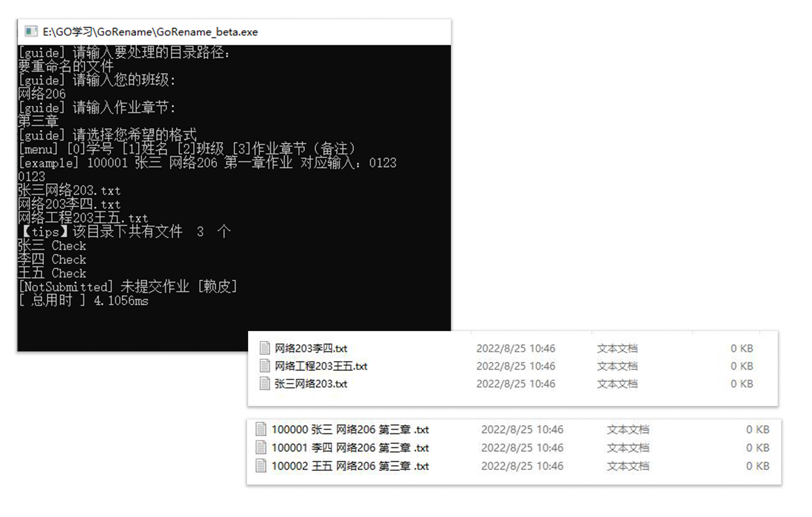
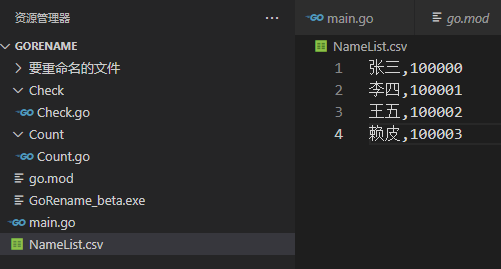

### GoRename 作业规范重命名小工具

**功能：**

> 1.按照一定格式重命名作业
> 2.找出没交作业的同学

**您需要准备：**

>1. 一份班级作业 （项目中的FILES_TO_RENAME内有部分文件，可用于测试重命名功能）
>2. 一份csv文件（NameList.csv），包含两列，第一列为姓名，第二列为学号。
>3. 双击exe文件，按照提示进行操作。（或在目录文件下执行 go run main.go）

**备注：**

> 请**不要**使用本程序对同学的作业**直接**进行操作，先**备份**一份作业比较保险，防止本程序抛出异常所导致的文件损坏。

**DEMO**

